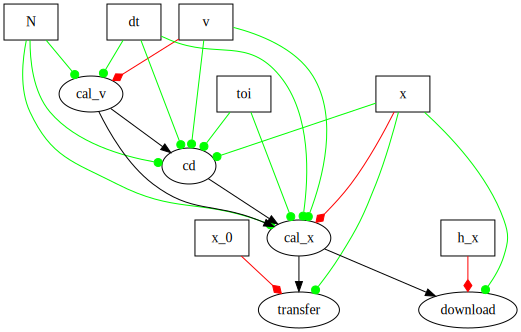

# muda
MUDA is **μ-CUDA**, yet another painless CUDA programming **paradigm**.

> stop bothering yourself using raw CUDA. Just stay elegant and clear-minded.

## overview

### direct launch

easy launch:

```c++
#include <muda/muda.h>
using namespace muda;
int main()
{
    Launch(1, 1)
        .apply(
        [] __device__() 
        {
            print("hello muda!\n"); 
        }).wait();
}
```

muda vs cuda:

```c++
/* 
* muda style
*/
void muda()
{
    DeviceVector<int>  dv(64, 1);
    Stream             s;
    ParallelFor(2, 16, 0, s) // parallel-semantic
        .apply(64, //automatically cover the range using (gridim=2, blockdim=16)
               [
                   // mapping from the device_vector to a proper viewer
                   // which can be trivially copy through device and host
                   dv = make_viewer(dv) 
               ] 
               __device__(int i) mutable
               { 
                   dv(i) *= 2; // safe, the viewer check the boundary automatically
               })
        .wait();// happy waiting, muda remember the stream.
    	//.apply(...) //if you want to go forward with the same config, just call .apply() again.
}


/* 
* cuda style
*/

// manually create kernel
__global__ void times2(int* i, int N) // modifying parameters is horrible
{
    auto tid = threadIdx.x;
    if(tid < N) // check corner case manaully
    {
        i[tid] *= 2;// unsafe: no boundary check at all
    }
}

void muda_vs_cuda()
{
    // to be brief, we just use thrust to allocate memory
    thrust::device_vector<int> dv(64, 1);
    // cast to raw pointer
    auto                       dvptr = thrust::raw_pointer_cast(dv.data());
    // create stream and check error
    cudaStream_t               s;
    checkCudaErrors(cudaStreamCreate(&s));
    // call the kernel (which always ruins the Intellisense, if you use VS.)
    times2<<<1, 64, 0, s>>>(dvptr, dv.size());
    // boring waiting and error checking
    checkCudaErrors(cudaStreamSynchronize(s));
}
```

### auto compute graph

**muda** can generate `cudaGraph` nodes and dependencies from your `eval()` call. And the `cudaGraphExec` will be automatically updated (minimally) if you update a `muda::ComputeGraphVar`, more details in [zhihu_ZH](https://zhuanlan.zhihu.com/p/658080362).

define a muda compute graph:

```c++
void compute_graph_simple()
{
    ComputeGraphVarManager manager;
    ComputeGraph graph{manager};

    // 1) define GraphVars
    auto& N   = manager.create_var<size_t>("N");
    // BufferView represents a fixed range of memory
    // dynamic memory allocation is not allowed in GraphVars
    auto& x_0 = manager.create_var<BufferView<Vector3>>("x_0");
    auto& x   = manager.create_var<BufferView<Vector3>>("x");
    auto& y   = manager.create_var<BufferView<Vector3>>("y");
    
    // 2) create GraphNode
    graph.create_node("cal_x_0") << [&]
    {
        // initialize values
        ParallelFor(256).apply(N.eval(),
                               [x_0 = x_0.eval().viewer()] __device__(int i) mutable
                               { x_0(i) = Vector3::Ones(); });
    };

    graph.create_node("copy_to_x") // copy
        << [&] { BufferLaunch().copy(x.eval(), x_0.ceval()); };

    graph.create_node("copy_to_y") // copy
        << [&] { BufferLaunch().copy(y.eval(), x_0.ceval()); };

    graph.create_node("print_x_y") << [&]
    {
        // print
        ParallelFor(256).apply(N.eval(),
                               [x = x.ceval().cviewer(),
                                y = y.ceval().cviewer(),
                                N = N.eval()] __device__(int i) mutable
                               {
                                   if(N <= 10)
                                       print("[%d] x = (%f,%f,%f) y = (%f,%f,%f) \n",
                                             i,
                                             x(i).x(),
                                             x(i).y(),
                                             x(i).z(),
                                             y(i).x(),
                                             y(i).y(),
                                             y(i).z());
                               });
    };
    // 3) visualize it using graphviz (for debug)
    graph.graphviz(std::cout);
}
```



launch a muda compute graph:

```c++
void compute_graph_simple()
{
    // resources
    auto N_value    = 4;
    auto x_0_buffer = DeviceVector<Vector3>(N_value);
    auto x_buffer   = DeviceVector<Vector3>(N_value);
    auto y_buffer   = DeviceVector<Vector3>(N_value);

    N.update(N_value);
    x_0.update(x_0_buffer);
    x.update(x_buffer);
    y.update(y_buffer);
    
    // create stream
    Stream stream;
    // sync graph on stream
    graph.launch(stream);
    // launch all nodes on a single stream (fallback to origin cuda kernel launch)
    graph.launch(true, stream);
}
```

## build

### xmake

run example:

```shell
$ xmake f --example=true
$ xmake 
$ xmake run muda_example hello_muda
```
to show all examples:

```shell
$ xmake run muda_example -l
```
play all examples:

```shell
$ xmake run muda_example
```
### cmake

```shell
$ mkdir CMakeBuild
$ cd CMakeBuild
$ cmake -S ..
$ cmake --build .
```

### copy headers

Because **muda** is header-only, just copy the `src/muda/` folder to your project, set the include directory, and then everything is done.

### macro

| Macro           | Value               | Details                                                      |
| --------------- | ------------------- | ------------------------------------------------------------ |
| `MUDA_CHECK_ON` | `1`(default) or `0` | `MUDA_CHECK_ON=1` for turn on all muda runtime check(for safety) |

If you manually copy the header files, don't forget to define the macros yourself. If you are using cmake or xmake, just set the project dependency to muda.

## tutorial

- [tutorial_zh](https://zhuanlan.zhihu.com/p/659664377)
- If you need an English version tutorial, please contact me or post an issue to let me know.

## Contribute

Go to [developer_zh.md](./doc/developer_zh.md) and [zhihu-ZH](https://zhuanlan.zhihu.com/p/592439225) for further info.


