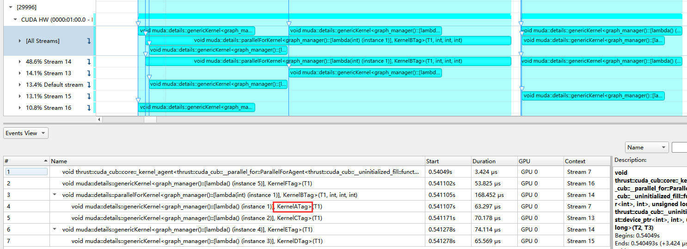

# Profile

## Tag 注入

我们以`muda_example graph_manager`为例。

[source code](../example/graph/graph_manager.cu)

其中我们可以看到：

```c++
struct KernelATag
{
};
```

这是一个用于标记Kernel调用的Tag Struct

我们这样使用它：

```c++
launch(1, 1).addNode(
    gm,            // add node to graph manager
    res{res_var},  // has resource (default type = read-write): res_var
    [var = make_viewer(res_var)] __device__() mutable
    {
        var = 1;
        some_work(1e4);
        print("[A] set var=%d\n", var);
    },
    KernelATag{});
```

这样，`KernelATag`将会被注入到核心`__global__`kernel函数的模板参数中（尽管这个参数对函数调用没有任何作用）。

在上面的例子中，这个核心的kernel函数为：

```c++
namespace muda::details
{
    template <typename F, typename UserTag>
    __global__ void genericKernel(F f)
    {
        f();
    }
}  // namespace details
```

[source code](../src/core/muda/launch/launch.h)

其中`UserTag`就是我们最后注入`KernelATag`的地方。

使用Tag的好处是：当我们使用匿名的lambda进行调用时，可以用它标记对应的Kernel。Profile时，我们可以从Nsight System等工具中看到调用Kernel的Tag。

例如：



我们发现，KernelA最终调用了核心`__global__`kernel函数`genericKernel`，他的Tag被显示在了KernelName中。

## 其他方法

- push range with name
- ...

[TODO]

