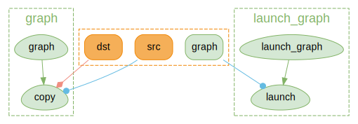
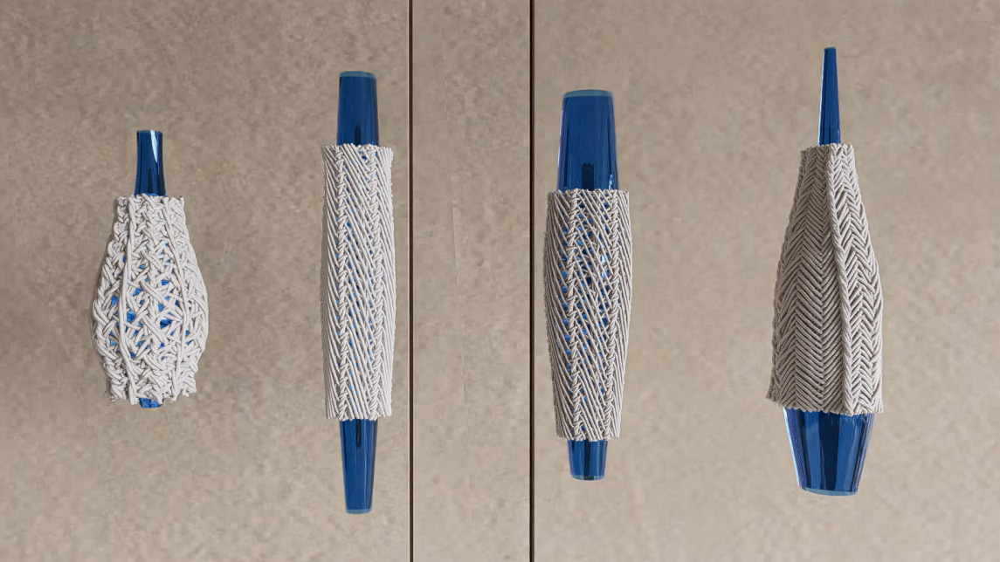

\mainpage Main Page

MUDA is **μ-CUDA**, yet another painless CUDA programming **paradigm**.

> COVER THE LAST MILE OF CUDA

[TOC]

# Introduction

## What is muda?

- Header-only library right out of the box
- Depends only on CUDA and standard libraries
- Improve readability, maintainability, security, and debugging efficiency of CUDA code.
- Reduce the difficulty of building CUDA Graphs and increase automation.

## Why muda?

Think that you wanna try a new idea or implement a demo with CUDA. If the demo works well, you want to embed it into your project quickly. But you find that using CUDA directly will be a catastrophic disaster.

Coding with C-API CUDA, you will be buried in irrelevant details, and the information density of the code is very low, which means that you need to write a lot of redundant code to achieve a simple function. Less is more, right?

Debugging the GPU code is a nightmare. How much time do you spend on those weird Error Codes from CUDA, and finally find it's an illegal memory access? 


Using a GPU Debugger when something goes wrong may be an approach. But the best way is to prevent bugs from happening, right? Most of the time, automatic range checking is all we want. It's a pretty fantasy that someone tells you, "Hey Bro, at `Block 103, Thread 45`, in kernel named `set_up_array`, the buffer named `array` goes out of range because your index is `100` while the array size is `96`." After that, it exits the kernel and stops the program for you to prevent later chained dummy bugs from producing confusing debug information.

It is muda! 

If you access memory resource using a MUDA **Viewer**. Dear muda will tell you all about that.

MUDA also provides an elegant way to create and update [CUDA Graph](https://developer.nvidia.com/blog/cuda-graphs/), called MUDA `ComputeGraph`.

- Users almost take only a bit of effort to switch from the Stream-Base Launch Mode to Graph Launch Mode.
- Updating the node parameters and shared resources in CUDA Graphs becomes intuitive, safe, and efficient.

Simple to extend.

- User can obey the primary interface of muda to define their own object to reuse the MUDA facility
- Almost all "Resource View Type" can be used directly in the MUDA `ComputeGraph`.

## A substitution of thrust?

**Nop!** MUDA is a supplement of thrust!

> [Thrust](https://docs.nvidia.com/cuda/thrust/index.html) is a C++ template library for CUDA based on the Standard Template Library (STL). Thrust allows you to implement high-performance parallel applications with minimal programming effort through a high-level interface that is fully interoperable with CUDA C.

Using iterators to prevent range error is a high-level approach. However, we still need to access the memory manually in our own kernel, no matter whether using raw cuda kernel launch `<<<>>>` or using thrust agent kernel (most of the time, using a `thrust::counting_iterator` in a `thrust::for_each` algorithm).

So, I think MUDA is a mid-level approach. We have the same purpose but different levels and aim at different problems. Feel comfortable to use them together!

Here is an example for using Thrust and MUDA together.

```cpp
using namespace muda;
using namespace thrust;

constexpr auto N = 10;
DeviceVector<float> x(N); // DeviceVector is derived from thrust::device_vector  

KernelLabel lebal{"setup_concise"}; // give a kernel label for better debug info

// equivalent to parallel for 
for_each(thrust::cuda::par_nosync, // no sync after execution
         make_counting_iterator(0), make_counting_iterator(N), // make a sequence from 0 -> N
         [x = x.viewer().name("x")] __device__(int i) mutable
         {
             x(i) = i; // safe access through muda viewer
         });
```

# Overview

This is a quick overview of some muda APIs. 

You can check it to find out something useful for you. A comprehensive description of MUDA is placed at [Tutorial](#Tutorial).

## Launch

Simple, self-explanatory, intellisense-friendly Launcher.

```cpp
#include <muda/muda.h>
using namespace muda;
__global__ void raw_kernel()
{
    printf("hello muda!\n");
}

int main()
{
    // just launch
    Launch(1, 1)
        .apply(
        [] __device__() 
        {
            print("hello muda!\n"); 
        }).wait();
    
    constexpr int N = 8;
    // dynamic grid
    ParallelFor(256 /*block size*/)
        .apply(N,
        [] __device__(int i) 
        {
            print("hello muda %d!\n", i); 
        }).wait();
    
    // grid stride loop
    ParallelFor(8  /*grid size*/, 
                32 /*block size*/)
        .apply(N,
        [] __device__(int i) 
        {
            print("hello muda %d!\n", i); 
        }).wait();
    
    // automatic block size choosing
    ParallelFor().apply(N,
        [] __device__(int i) 
        {
            print("hello muda %d!\n", i); 
        }).wait();
    
    // intellisense-friendly wrapper 
    Kernel{32/*grid size*/, 64/*block size*/,0/*shared memory*/, stream, other_kernel}(...)
}
```

## Logger

A `std::cout` like output stream with overload formatting.

```cpp
Logger logger;
Launch(2, 2)
    .apply(
        [logger = logger.viewer()] __device__() mutable
        {
            // type override
            logger << "int2: " << make_int2(1, 2) << "\n";
            logger << "float3: " << make_float3(1.0f, 2.0f, 3.0f) << "\n";
        })
    .wait();
// download the result to any ostream you like. 
logger.retrieve(std::cout);
```

You can define a global`__device__ LoggerViewer cout` and call the overloaded constructor `Logger(LoggerViewer* global_viewer)` to use it without any capturing, which is useful when you need to use logger in some function but don't want to put the `LoggerViewer` in the function parameter.

```cpp
namespace foo
{
__device__ LoggerViewer cout;
__device__ void say_hello() { cout << "hello global logger!\n"; }
}

int main()
{
    // setup global logger
    LoggerViewer* viewer_ptr = nullptr;
    checkCudaErrors(cudaGetSymbolAddress((void**)&viewer_ptr, foo::cout));
    Logger logger(viewer_ptr);
    
    Launch().apply([]__device__() mutable
        {
            foo::say_hello();
        })
    .wait();
    
    logger.retrieve(std::cout);
}
```

Further, you can use `muda::Debug::set_sync_callback()` to retrieve the output once `wait()` is called, as:

```cpp
__device__ LoggerViewer cout;

int main()
{
    // setup global logger
    LoggerViewer* viewer_ptr = nullptr;
    checkCudaErrors(cudaGetSymbolAddress((void**)&viewer_ptr, foo::cout));
    Logger logger(viewer_ptr);
    
    muda::Debug::set_sync_callback([&] { logger.retrieve(std::cout); });
    
    Launch().apply([]__device__() mutable
        {
            cout << "hello\n";
        })
    .wait();
    
    // no need to retrieve manully
}
```

## Buffer

A lightweight `std::vector`-like cuda device memory container. 

In addition, 2D/3D aligned buffers are also provided.

```cpp
DeviceBuffer<int> buffer;

// copy from std::vector
std::vector<int> host(8);
buffer.copy_from(host);

// copy to raw memory
int host_array[8];
buffer.copy_to(host_array);

// use BufferView to copy sub-buffer
buffer.view(0,4).copy_from(host.data());

DeviceBuffer<int> dst_buffer{4};
// use BufferView to copy sub-buffer
buffer.view(0,4).copy_to(dst_buffer.view());

// safe and easy resize
DeviceBuffer2D<int> buffer2d;
buffer2d.resize(Extent2D{5, 5}, 1);
buffer2d.resize(Extent2D{7, 2}, 2);
buffer2d.resize(Extent2D{2, 7}, 3);
buffer2d.resize(Extent2D{9, 9}, 4);
// subview 
buffer2d.view(Offset2D{1,1}, Extent2D{3,3});
buffer2d.copy_to(host);

DeviceBuffer3D<int> buffer3d;
buffer3d.resize(Extent3D{3, 4, 5}, 1);
buffer3d.copy_to(host);
```

The old data will be safely kept if you resize a 2D or 3D buffer. If you don't want to keep the old data, use `.clear()` before your `.resize()`. The result of the above chain of 2D buffer resizing is shown below.


## Viewer In Kernel

MUDA **Viewers** provide safe inner-kernel memory access, which checks all input to ensure access does not go out of range and does not dereference a null pointer. If something goes wrong, they report the debug information as much as possible and trap the kernel to prevent further errors. Don't forget to fill the `kernel_name()` and `name()` out.

```cpp
DeviceVar<int> single;
DeviceBuffer<int> array;
DeviceBuffer2D<int> array2d;
DeviceBuffer3D<int> array3d;
Logger logger;
Launch()
    .kernel_name(__FUNCTION__)
    .apply(
    [
        single  = single.viewer().name("single"), // give a name for more readable debug info
        array   = buffer.viewer().name("array"),
        array2d = buffer_2d.viewer().name("array2d"),
        array3d = buffer_3d.viewer().name("array3d"),
        logger  = logger.viewer(),
        ...
    ] __device__ () mutable
    {
        single = 1;
        array(i) = 1;
        array2d(offset_in_height, offset_in_width) = 1;
        array3d(offset_in_depth, offset_in_height, offset_in_width) = 1;
        logger << 1;
    });
```

## Event And Stream

If you don't want to launch something on the default stream, use `Stream` to create async streams. And you can use `Event` to synchronize between streams.

```cpp
Stream         s1, s2;
Event          set_value_done;

DeviceVar<int> v = 1;
on(s1)
    .next<Launch>(1, 1)
    .apply(
        [v = v.viewer()] __device__() mutable
        {
            int next = 2;
            v = next;
        })
    .record(set_value_done)
    .apply(
        [] __device__()
        {
            some_work();
        });

on(s2)
    .when(set_value_done)
    .next<Launch>(1, 1)
    .apply([v = v.viewer()] __device__()
           { int res = v; });
```

## Asynchronous Operation

MUDA **Launchers**' functions are Asynchronous, meaning we need to call `.wait()` to synchronize it on the host, unlike some APIs such as `BufferView::copy_fom`. NOTE: Operations of a **Launcher** will be asynchronous as possible, so you should synchronize the stream by yourself, while other APIs will synchronize themselves.

```cpp
// kernel launch
Kernel{..., f}(...);
Launch(stream).apply(...).wait();
ParallelFor(stream).apply(N, ...).wait();

// graph launch
GraphLaunch().launch(graph).wait();

// Memory
Memory(stream).copy(...).wait();
Memory(stream).set(...).wait();

// Buffer: for BufferView/Buffer2DView/Buffer3DView
BufferLaunch(stream).copy(BufferView, ...).wait();
BufferLaunch(stream).fill(BufferView,...).wait();
```

Feel free to ignore `Memory` `BufferLaunch` **Launcher** when building your fast demo. Directly use the convenient synchronous APIs of `DeviceBuffer/BufferView` until you find it's the performance hotpot that will save you a lot of time.

It's a good practice to keep **Launchers** asynchronous while keeping other APIs synchronous, which obeys the 80/20 rule.

## [Extension] Linear System Support

[We are still working on this part]

**MUDA** supports basic linear system operations. e.g.:

1. Sparse Matrix Format Conversion
2. Sparse Matrix Assembly
3. Linear System Solving


The only thing you need to do is to declare a `muda::LinearSystemContext`.

```cpp
LinearSystemContext ctx;
// non-unique triplets of (row_index, col_index, block3x3)
DeviceTripletMatrix<float, 3> A_triplet;
// setup the triplet matrix dimension
A_triplet.reshape(block_rows,block_cols);
// resize the triplets, we should know the total count of the triplets.
A_triplet.resize_triplets(hessian_count); 

// unique triplets of (row_index, col_index, block3x3) faster SPMV than TripletMatrix
DeviceBCOOMatrix<float,3> A_bcoo; 

// block compressed sparse row format, faster SPMV than BCOOMatrix
DeviceBSRMatrix<float,3> A_bsr; 

// compressed sparse row format, slower SPMV than BSRMatrix
DeviceCSRMatrix<float,3> A_csr

// trivial dense matrix 
DeviceDenseMatrix<float> A_dense; 

// convert:
ctx.convert(A_triplet, A_bcoo);
ctx.convert(A_bcoo, A_bsr);
ctx.convert(A_bsr, A_dense);
ctx.convert(A_bsr, A_csr);
ctx.convert(A_bcoo, A_dense);

// so for the Sparse Vector ...
```

We only allow users to assemble a Sparse Matrix from Triplet Matrix. And allow users to read from BCOOMatrix.

To assemble a Triplet Matrix, user need to use the `viewer` of a Triplet Matrix.

```cpp
DeviceTripletMatrix<float, 3> A_triplet;
A_triplet.resize(block_rows,block_cols,hessian_count);
DeviceDenseVector<float> x, b;
x.resize(block_rows * 3);
b.resize(block_rows * 3)

ParallelFor(256/*block size*/)
    .apply(hessian_count,
    [
        H = A_triplet.viewer().name("Hessian"),
        g = x.viewer().name("gradient")
        // some infos to build up hessian and gradient
    ] __device__(int i) 
    {
        int row, col;
        Eigen::Matrix3f hessian; // fill the local hessian, using your infos
        Eigen::Vector3f gradient;
        
        // write the (row, col, hessian) to the i-th triplet
        H(i).write(row,col, hessin);
        
        // atomic add the gradient vector
        g.segment<3>(row * 3).atomic_add(gradient);
    }).wait();

// convert to bcoo for better performance on SPMV.
ctx.convert(A_triplet, A_bcoo);
ctx.convert(A_bcoo, A_bsr);

// maybe in some iterative solver:
ctx.spmv(A_bsr.cview(), x.cview(), b.view());
```

[TODO:] Later, we may involve [Expression Template](https://en.wikipedia.org/wiki/Expression_templates) to strengthen the linear algebra calculation and use lazy evaluation to arrange as many element-wise/scattering operations as possible in a single kernel.

## [Extension] Field Layout

MUDA now supports the `SoA/AoS/AoSoA` layouts. Users can switch between them seamlessly(with different builder parameters). The copy operation in all directions and layouts is well-supported.

Most of the time, `AoSoA` is the best layout for Vector and Matrix, with better [memory coalescing](https://nichijou.co/cuda5-coalesce/) and more compact memory storage. With the help of `Eigen::Map<>`, the read/write of a Vector/Matrix is as trivial as accessing a struct-version Vector/Matrix.

Here is a simple example of `muda::Field`.

```cpp
#include <muda/ext/field.h> // all you need for muda::Field

void field_example(FieldEntryLayout layout)
{
    using namespace muda;
    using namespace Eigen;

    Field field;
    // create a subfield called "particle"
    // any entry in this field has the same size
    auto& particle = field["particle"];
    float dt       = 0.01f;

    // build the field:
    // auto builder = particle.AoSoA(); // compile time layout
    auto builder = particle.builder(FieldEntryLayout::AoSoA);  // runtime layout
    auto& m      = builder.entry("mass").scalar<float>();
    auto& pos    = builder.entry("position").vector3<float>();
    auto& pos_old = builder.entry("position_old").vector3<float>();
    auto& vel     = builder.entry("velocity").vector3<float>();
    auto& force   = builder.entry("force").vector3<float>();
    // matrix is also supported, but in this example we don't use it
    auto& I = builder.entry("inertia").matrix3x3<float>();
    builder.build();  // finish building the field

    // set size of the particle attributes
    constexpr int N = 10;
    particle.resize(N);

    Logger logger;

    ParallelFor(256)
        .kernel_name("setup_vars")
        .apply(N,
               [logger = logger.viewer(),
                m      = m.viewer(),
                pos    = pos.viewer(),
                vel    = vel.viewer(),
                f      = force.viewer()] __device__ (int i) mutable
               {
                   m(i)   = 1.0f;
                   // a row of particles with position=(i,1,0)
                   pos(i) = Vector3f::UnitY() + Vector3f::UnitX() * i;
                   vel(i) = Vector3f::Zero();
                   f(i)   = Vector3f{0.0f, -9.8f, 0.0f};

                   logger << "--------------------------------\n"
                          << "i=" << i << "\n"
                          << "m=" << m(i) << "\n"
                          << "pos=" << pos(i) << "\n"
                          << "vel=" << vel(i) << "\n"
                          << "f=" << f(i) << "\n";
               })
        .wait();

    logger.retrieve();

    ParallelFor(256)
        .kernel_name("integration")
        .apply(N,
               [logger = logger.viewer(),
                m      = m.cviewer(),
                pos    = pos.viewer(),
                vel    = vel.viewer(),
                f      = force.cviewer(),
                dt] __device__ (int i) mutable
               {
                   auto     x = pos(i);
                   auto     v = vel(i);
                   Vector3f a = f(i) / m(i);

                   v = v + a * dt;
                   x = x + v * dt;

                   logger << "--------------------------------\n"
                          << "i=" << i << "\n"
                          << "m=" << m(i) << "\n"
                          << "pos=" << pos(i) << "\n"
                          << "vel=" << vel(i) << "\n"
                          << "f=" << f(i) << "\n";
               })
        .wait();

    logger.retrieve();

    // copy between entry and host
    std::vector<Vector3f> positions;
    pos.copy_to(positions);
    pos.copy_from(positions);

    // copy between entries
    pos_old.copy_from(pos);

    // copy between buffer and entry
    DeviceBuffer<Vector3f> pos_buf;
    pos.copy_to(pos_buf);
    pos.copy_from(pos_buf);
    
    // using cub to do reduction on any format
    DeviceVar<float> total_mass;
    DeviceReduce().Sum(m.view(), total_mass.view(), m.count());
}
```

Additionally, resizing a subfield will resize all the entries, and the resizing is safe; all entries will be copied to a new buffer if the new size exceeds the capacity.

```cpp
// safe resize, all entries will be copied to the new buffer.
particle.resize(N * 2);
```

It'd be useful if the topology will change in your simulation. For example, the fracture simulation always changes its tetrahedron mesh, and all attributes of particles, edges, triangles, and tetrahedra will change correspondently. It will be terrible if you resize all the attributes yourself.

Note that every `FieldEntry` has a `View` called `FieldEntryView`. A `FieldEntryView` can be regarded as a `ComputeGraphVar`(see below), which means `FieldEntry` can also be used in `ComputeGraph`. 

## Compute Graph

Define `MUDA_WITH_COMPUTE_GRAPH`  to turn on `Compute Graph` support.

**MUDA** can generate `cudaGraph` nodes and dependencies from your `eval()` call. And the `cudaGraphExec` will be automatically updated (minimally) if you update a `muda::ComputeGraphVar`. More details in [zhihu_ZH](https://zhuanlan.zhihu.com/p/658080362).

Define a muda compute graph:

```cpp
void compute_graph_simple()
{
    ComputeGraphVarManager manager;
    ComputeGraph graph{manager};

    // 1) define GraphVars
    auto& N   = manager.create_var<size_t>("N");
    // BufferView represents a fixed range of memory
    // dynamic memory allocation is not allowed in GraphVars
    auto& x_0 = manager.create_var<BufferView<Vector3>>("x_0");
    auto& x   = manager.create_var<BufferView<Vector3>>("x");
    auto& y   = manager.create_var<BufferView<Vector3>>("y");
    
    // 2) create GraphNode
    graph.create_node("cal_x_0") << [&]
    {
        // initialize values
        ParallelFor(256).apply(N.eval(),
                               [x_0 = x_0.eval().viewer()] __device__(int i) mutable
                               { x_0(i) = Vector3::Ones(); });
    };

    graph.create_node("copy_to_x") // copy
        << [&] { BufferLaunch().copy(x.eval(), x_0.ceval()); };

    graph.create_node("copy_to_y") // copy
        << [&] { BufferLaunch().copy(y.eval(), x_0.ceval()); };

    graph.create_node("print_x_y") << [&]
    {
        // print
        ParallelFor(256).apply(N.eval(),
                               [x = x.ceval().cviewer(),
                                y = y.ceval().cviewer(),
                                N = N.eval()] __device__(int i) mutable
                               {
                                   if(N <= 10)
                                       print("[%d] x = (%f,%f,%f) y = (%f,%f,%f) \n",
                                             i,
                                             x(i).x(),
                                             x(i).y(),
                                             x(i).z(),
                                             y(i).x(),
                                             y(i).y(),
                                             y(i).z());
                               });
    };
    // 3) visualize it using graphviz (for debug)
    graph.graphviz(std::cout);
}
```


Launch a muda compute graph:

```cpp
void compute_graph_simple()
{
    // resources
    auto N_value    = 4;
    auto x_0_buffer = DeviceVector<Vector3>(N_value);
    auto x_buffer   = DeviceVector<Vector3>(N_value);
    auto y_buffer   = DeviceVector<Vector3>(N_value);

    N.update(N_value);
    x_0.update(x_0_buffer);
    x.update(x_buffer);
    y.update(y_buffer);
    
    // create stream
    Stream stream;
    // sync graph on stream
    graph.launch(stream);
    // launch all nodes on a single stream (fallback to origin cuda kernel launch)
    graph.launch(true, stream);
}
```

## Dynamic Parallelism

MUDA support dynamic parallelism based on MUDA ComputeGraph.

```cpp
void dynamic_parallelism_graph()
{
    std::vector<int> host(16);
    std::iota(host.begin(), host.end(), 0);

    ComputeGraphVarManager manager;
    // create graph
    ComputeGraph      graph{manager, "graph", ComputeGraphFlag::DeviceLaunch};
    // create resource
    DeviceBuffer<int> src = host;
    DeviceBuffer<int> dst(host.size());
	
    // create graph var
    auto& src_var = manager.create_var("src", src.view());
    auto& dst_var = manager.create_var("dst", dst.view());
	
    // create graph node
    graph.$node("copy")
    {
        BufferLaunch().copy(dst_var, src_var);
    };
    // build graph
    graph.build();
	
    // create a scheduler graph
    ComputeGraph launch_graph{manager, "launch_graph", ComputeGraphFlag::DeviceLaunch};
    auto& graph_var = manager.create_var("graph", graph.viewer());
	
    // create a node to launch our graph
    launch_graph.$node("launch")
    {
        Launch().apply(
            [graph = graph_var.ceval()] $()
            {
                graph.tail_launch();
            });
    };
    // graphviz all graph we created
    manager.graphviz(std::cout);
    // launch and wait
    launch_graph.launch().wait();
}
```



## MUDA vs. CUDA

```cpp
/* 
* muda style
*/
void muda()
{
    DeviceBuffer<int>  dv(64);
    dv.fill(1);
    
    ParallelFor(256) // parallel-semantic
        .kernel_name("my_kernel") // or just .kernel_name(__FUNCTION__)
        .apply(64, // automatically cover the range
               [
                   // mapping from the DeviceBuffer to a proper viewer
                   // which can be trivially copy through device and host
                   dv = dv.viewer().name("dv")
               ] 
               __device__(int i) mutable
               { 
                   dv(i) *= 2; // safe, the viewer check the boundary automatically
               })
        .wait();// happy waiting, muda remember the stream.
    	//.apply(...) //if you want to go forward with the same config, just call .apply() again.
}


/* 
* cuda style
*/

// manually create kernel
__global__ void times2(int* i, int N) // modifying parameters is horrible
{
    auto tid = threadIdx.x;
    if(tid < N) // check corner case manaully
    {
        i[tid] *= 2;// unsafe: no boundary check at all
    }
}

void cuda()
{
    // to be brief, we just use thrust to allocate memory
    thrust::device_vector<int> dv(64, 1);
    // cast to raw pointer
    auto dvptr = thrust::raw_pointer_cast(dv.data());
    // create stream and check error
    cudaStream_t s;
    checkCudaErrors(cudaStreamCreate(&s));
    // call the kernel (which always ruins the Intellisense, if you use VS.)
    times2<<<1, 64, 0, s>>>(dvptr, dv.size());
    // boring waiting and error checking
    checkCudaErrors(cudaStreamSynchronize(s));
}
```

# Build

## Xmake

Run example:

```shell
$ xmake f --example=true
$ xmake 
$ xmake run muda_example hello_muda
```
To show all examples:

```shell
$ xmake run muda_example -l
```
Play all examples:

```shell
$ xmake run muda_example
```
## Cmake

```shell
$ mkdir CMakeBuild
$ cd CMakeBuild
$ cmake -S ..
$ cmake --build .
```

## Copy Headers

Because **muda** is header-only, copy the `src/muda/` folder to your project, set the include directory, and everything is done.

## Macro

| Macro                     | Value               | Details                                                      |
| ------------------------- | ------------------- | ------------------------------------------------------------ |
| `MUDA_CHECK_ON`           | `1`(default) or `0` | `MUDA_CHECK_ON=1` for turn on all muda runtime check(for safety) |
| `MUDA_WITH_COMPUTE_GRAPH` | `1`or`0`(default)   | `MUDA_WITH_COMPUTE_GRAPH=1` for turn on muda compute graph feature |

If you manually copy the header files, don't forget to define the macros yourself. If you use cmake or xmake, just set the project dependency to muda.

# Tutorial

[TODO]

# Examples

All examples in `muda/example` are self-explanatory,  enjoy it.


# Contributing

Contributions are welcome. We are looking for or are working on:

1. **muda** development

2. fancy simulation demos using **muda**

3. better documentation of **muda**

# Related Work

- Topological braiding simulation using **muda** (old version)

  ```latex
  @article{article,
  author = {Lu, Xinyu and Bo, Pengbo and Wang, Linqin},
  year = {2023},
  month = {07},
  pages = {},
  title = {Real-Time 3D Topological Braiding Simulation with Penetration-Free Guarantee},
  volume = {164},
  journal = {Computer-Aided Design},
  doi = {10.1016/j.cad.2023.103594}
  }
  ```

  

  


